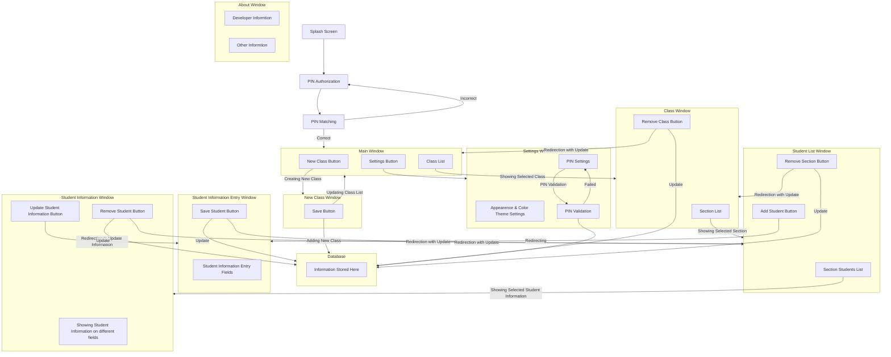

# <picture><source media="(prefers-color-scheme: dark)" srcset="https://github.com/Sayad-Uddin-Tahsin/Rotary-School-Student-Management/blob/main/Assets/Logo%20Light.png?raw=true"></picture>  Rotary School Student Management

Rotary School Student Management is a Software made for Rotary School Khulna for organizing the Student Information in a Digital Way! With this software, Student Information can be easily managed for different classes and sections.

## How it works?
Only need for this software is seemless internet connection. This software uses a Cloud Database to store student information. It has a security PIN system to keep the data secured from unauthorized access of the Software. Here's a diagram represents the Software:

## Installation
The installer for the Rotary School Student Management Software will require a unique Serial Key to access. This approach is taken in the interest of user privacy and security to ensure that sensitive student data remains protected and in compliance with privacy regulations. As such, the installer will not be made publicly available.

We prioritize the security and privacy of student data and appreciate your understanding in this matter.

## License
This project is licensed under the [MIT License](./LICENSE).
